# logged-cloud/page-studio

A Laravel package that turns "let users build pages and routes from a form" into a small, focused product. Three stacked stages:

1. **Route builder** — type a URL, right-click any segment to turn it into a reusable variable (with type, rules, and examples).
2. **Page builder** — Shopify-style drag-and-drop block authoring, scoped to the route. Layout blocks accept nested children in named slots.
3. **Node editor** — Blender-style node graph for composing new variables out of route values, constants, model lookups, transforms, math, image filters, and user-defined custom nodes.

Designed to drop into any Livewire 3+ Laravel app.

**Multiple authors on the same page**, no WebSocket dependency:

- **Block locks** · the block another reviewer is editing dims with a "🔒 Alice editing" ribbon. 30-second TTL with a refreshable lease, so a closed tab releases the lock automatically.
- **Presence chips** in the top bar show who else is currently viewing the page (initials per peer, full name on hover).
- **Review threads** · per-block comment threads with replies and a resolve / re-open lifecycle. Indicator pips on each block show open-thread counts; the right-rail Comments tab opens the full discussion. `page-studio:comment:added` event fires per post for Slack / channel-partner integrations.
- **Activity feed** in the right rail records save / publish / comment / lock events with verb icons in reverse-chronological order. Per-page audit trail, no extra service to run.

All four features ship out of the box on v2.2+ · short-poll based (~8s heartbeat), pluggable for a Reverb / Pusher swap later.

> **Extending the studio?** Step-by-step tutorials live under `docs/tutorials/`:
> [Custom block](docs/tutorials/custom-blocks.md) · [Custom node](docs/tutorials/custom-nodes.md) · [Custom template](docs/tutorials/custom-templates.md) · [Theming + light mode](docs/tutorials/theming.md) · [Migrate HTML content](docs/tutorials/migrate-html.md)

---

## Contents

- [Screenshots](#screenshots)
- [Collaboration](#collaboration) · block locks, presence, comments, activity feed
- [Install](#install)
- [Quick start](#quick-start)
- [Passing variables in](#passing-variables-in)
- [Rendering a page without the route builder](#rendering-a-page-without-the-route-builder)
- [Use cases beyond the obvious](#use-cases-beyond-the-obvious) · email · marketing landings · dashboards · documents · onboarding · knowledge base · A/B variants · SMS · status pages
- [Route builder](#route-builder)
- [Page builder](#page-builder)
- [Node editor (Blender-style)](#node-editor-blender-style)
- **Tutorials**
  - [Custom blocks · developer-defined](docs/tutorials/custom-blocks.md)
  - [Custom nodes · developer-defined](docs/tutorials/custom-nodes.md)
  - [Custom templates · seed routes + pages + graphs in one shot](docs/tutorials/custom-templates.md)
  - [Theming · light mode + your own palette](docs/tutorials/theming.md)
  - [Migrate HTML content into the block tree](docs/tutorials/migrate-html.md)
- [Starter templates](#starter-templates)
- [Importing existing HTML](#importing-existing-html)
- [Custom blocks (in this README)](#custom-blocks--developer-defined)
- [Custom nodes (in this README)](#custom-nodes--developer-defined)
- [Variable types](#variable-types)
- [Render cache](#render-cache)
- [Engine internals](#engine-internals)
- [Theming](#theming)
- [Events](#events)
- [Permissions](#permissions)
- [Model discovery](#model-discovery)
- [Disabling parts of the editor](#disabling-parts-of-the-editor)
- [Testing](#testing)
- [License](#license) · what's permitted today, two-year MIT conversion
- [How page-studio compares](docs/comparison.md) · vs. Filament, Statamic, Gutenberg, Builder.io and friends

---

## Screenshots

The node editor: drag values out of the URL, transform them through a graph, expose the result as named variables the page can substitute.

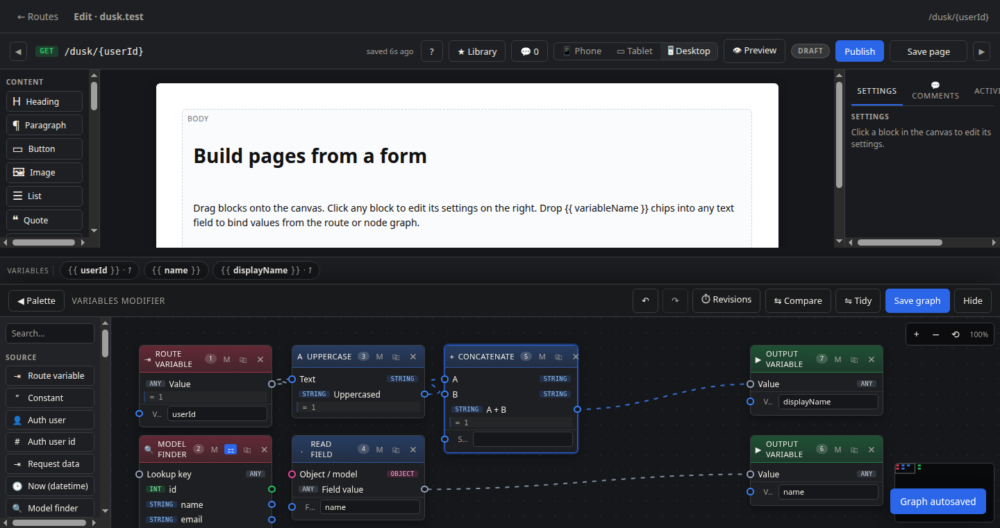

The page builder: drag blocks onto the canvas, click a block to edit its settings on the right, drop variable chips into any text field.

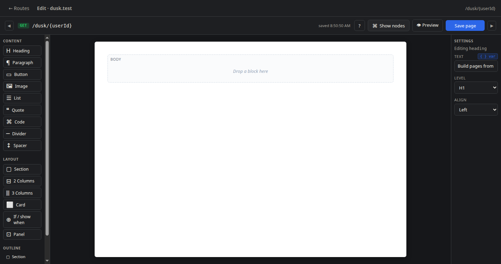

The route builder: every saved route in one place, with the compiled path template and the variables it references.

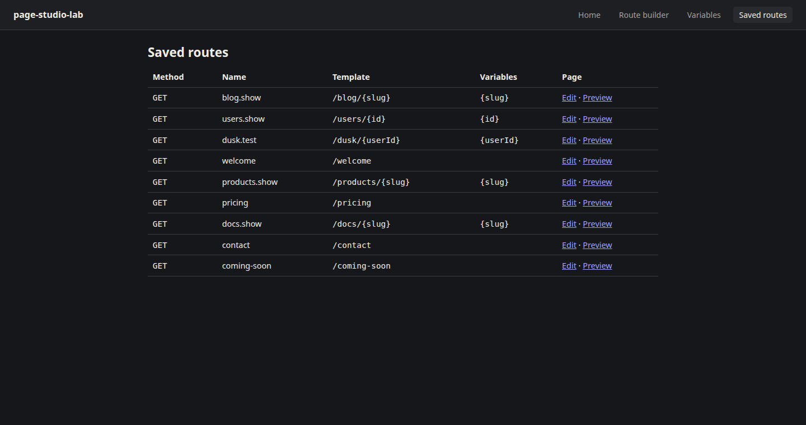

The variable library: every reusable variable across the project, with examples and a count of routes that wire it.

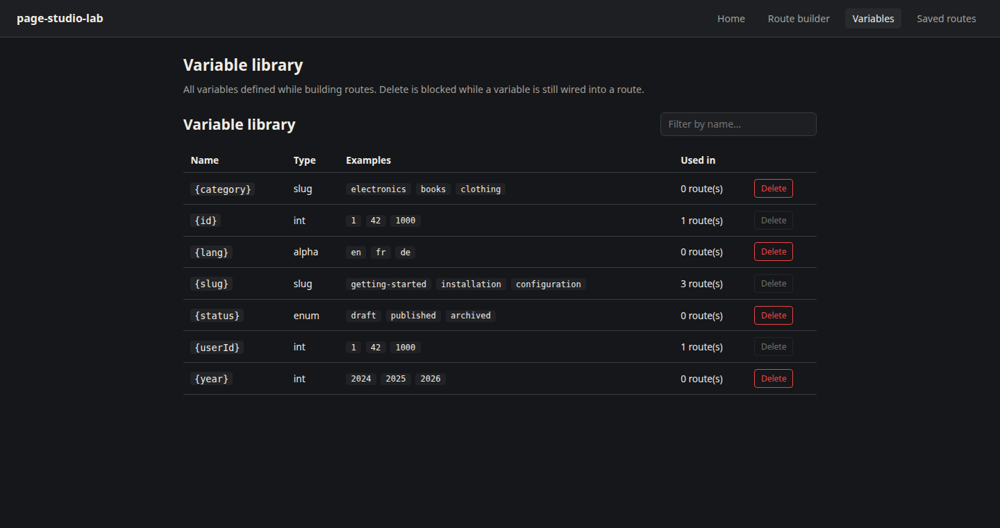

The node palette: searchable, grouped by source / transform / image / output, with built-in + developer-defined types side by side.

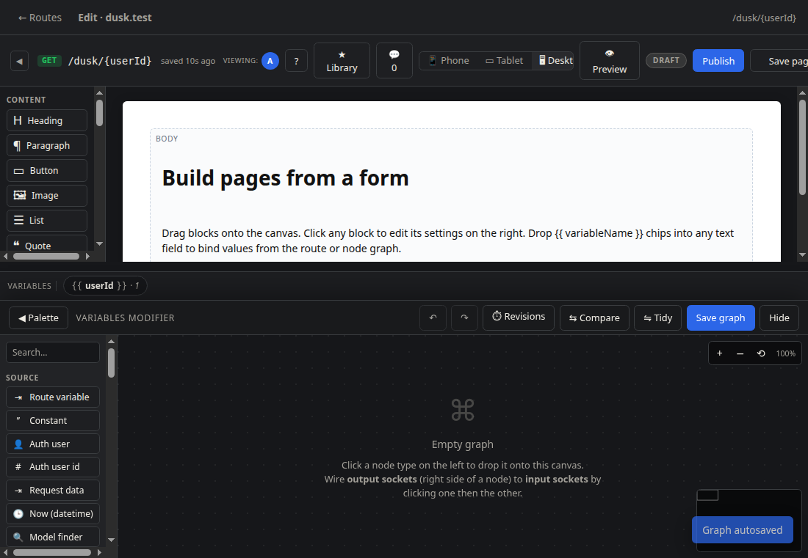

The in-page finder: Ctrl-F or `/` opens a palette over blocks and nodes, with type-or-text matching, keyboard navigation, and click-to-jump.

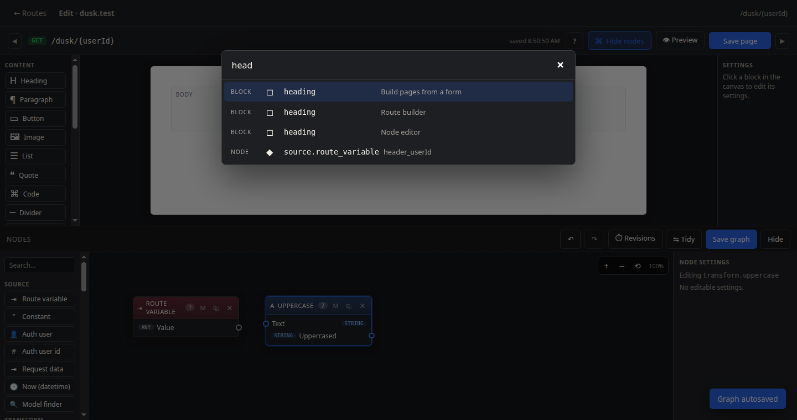

Mobile: the rails collapse to slide-in sheets, the node drawer hides by default, the canvas owns the screen. Touch users get a real surface to work on.

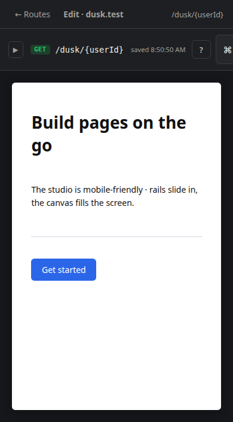

---

## Collaboration

Two people authoring the same page get a polling-based collaboration layer · no WebSocket dependency, no extra service to run.

### Block locks

When one author opens a block in the right-panel settings, an exclusive lease is taken for ~30 seconds (refreshed every 8s by a heartbeat). Other reviewers see the block dimmed with a ribbon naming the current editor and can't accidentally clobber the change.

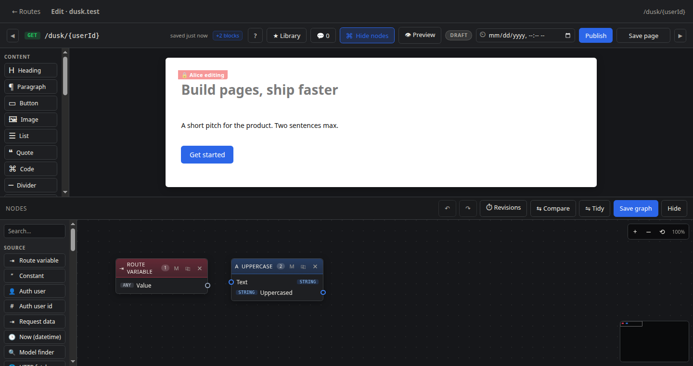

### Presence chips

The top bar surfaces the other peers currently editing the page as initials chips. Hover for the full name + last-seen timestamp. Closed tabs drop out of presence within the heartbeat window.

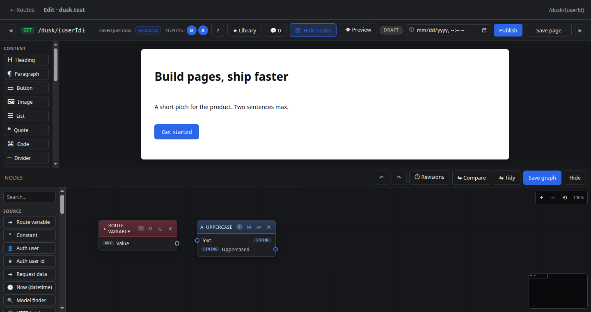

### Review threads

Every block can carry a comment thread · 💬 button in the block handle starts a new thread; the right rail Comments tab gathers every open thread on the page. Replies nest under the parent; resolved threads collapse but stay in the history. The block wrap shows a red pip with the open count so unresolved threads are obvious at a glance.

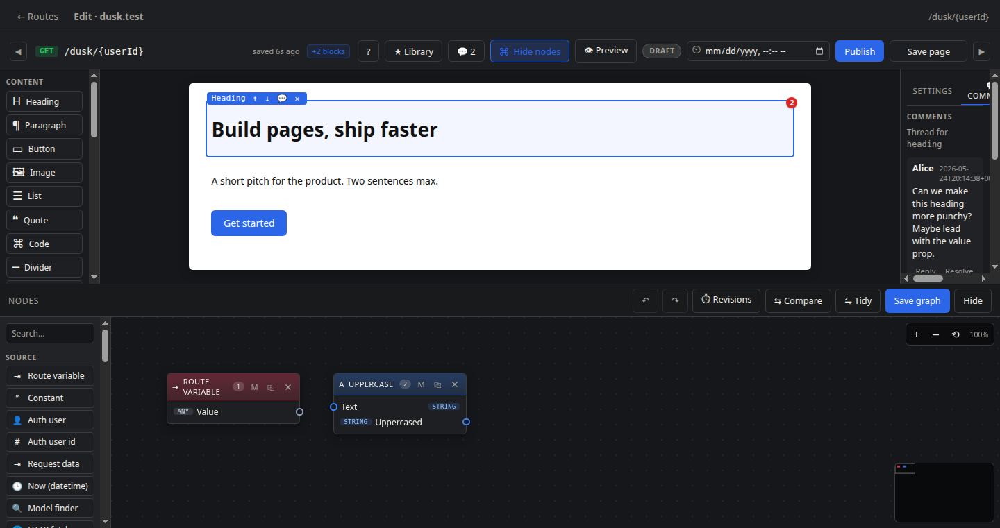

### Activity feed

The right rail's Activity tab is a per-page audit · save / publish / comment / lock-acquire events with verb icons in reverse-chronological order. Drops you into the editor's history without needing a separate audit log service.

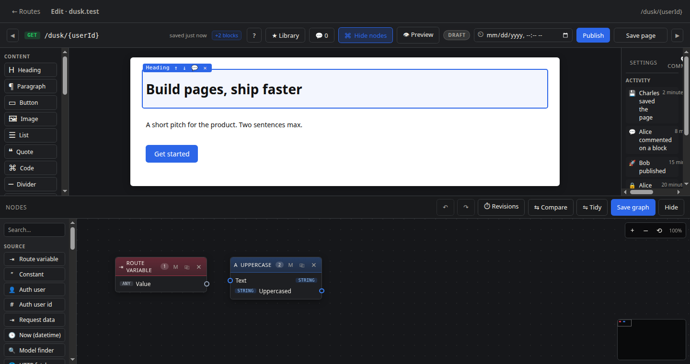

---

## Install

```bash
composer require logged-cloud/page-studio
php artisan migrate
```

Publish the config / views / migrations if you want to fork them:

```bash
php artisan vendor:publish --tag=page-studio-config
php artisan vendor:publish --tag=page-studio-views
php artisan vendor:publish --tag=page-studio-migrations
```

The Livewire components mount as soon as `livewire/livewire` is present:

- `page-studio.route-builder`
- `page-studio.variable-library`
- `page-studio.page-builder`
- `page-studio.custom-node-form`

---

## Quick start

```blade
{{-- The full studio · route builder + page builder + node editor wired to a route --}}
@livewire('page-studio.route-builder')
@livewire('page-studio.page-builder', ['routeId' => $route->id])
```

That's the three-stage flow. The rest of this section covers the two common variations: passing variables in directly, and rendering pages without using the route builder at all.

---

## Passing variables in

The page-builder accepts a `variables` payload at mount time. Authors see one drag chip per entry; the renderer substitutes the values into `{{ tokens }}` at output time.

### Flat shape · `name => preview`

```blade
@livewire('page-studio.page-builder', [
    'variables' => [
        'campaign_name' => 'Summer 2026',
        'client_email'  => 'foo@bar.com',
    ],
])
```

### Eloquent models · auto-flattened to dot-paths

Pass a whole model and the builder exposes one chip per attribute:

```blade
@livewire('page-studio.page-builder', [
    'variables' => [
        'user'    => auth()->user(),     // chips: {{ user }}, {{ user.name }}, {{ user.email }}, ...
        'booking' => $booking,           // chips: {{ booking }}, {{ booking.id }}, {{ booking.total }}, ...
    ],
])
```

`{{ user.email }}` resolves via Laravel's `data_get`, so the same shape also works for nested arrays:

```blade
@livewire('page-studio.page-builder', [
    'variables' => [
        'config' => ['from_name' => 'Acme', 'reply_to' => 'support@acme.com'],
    ],
])
{{-- {{ config.from_name }} → 'Acme' --}}
```

### Richer per-chip labels

If you want a friendlier chip label than the variable name:

```blade
@livewire('page-studio.page-builder', [
    'variables' => [
        ['name' => 'campaign_name', 'label' => 'Campaign', 'preview' => 'Summer 2026'],
        ['name' => 'client_email',  'label' => 'Client email', 'preview' => 'foo@bar.com'],
    ],
])
```

---

## Rendering a page without the route builder

If you skip the route builder you're responsible for two things: **where the blocks live**, and **where they render**. There's no magic auto-route in this mode.

### Step 1 · Store the blocks somewhere

Two options, pick what fits the rest of your schema:

```php
// Option A · the package's Page table, with route_id null
use LoggedCloud\PageStudio\Models\Page;

$page = Page::create([
    'route_id' => null,
    'blocks'   => [],   // empty until the author saves
]);

// Option B · your own column on your own model
Schema::table('campaigns', fn ($t) => $t->json('blocks')->nullable());

class Campaign extends Model
{
    protected $casts = ['blocks' => 'array'];
}
```

### Step 2 · Mount the page-builder against the storage you picked

```blade
{{-- A · bind to the package's Page row directly --}}
@livewire('page-studio.page-builder', [
    'pageId'    => $page->id,
    'variables' => ['campaign' => $campaign, 'user' => auth()->user()],
])

{{-- B · ephemeral · listen for the saved event and store the blocks yourself --}}
@livewire('page-studio.page-builder', [
    'variables' => ['campaign' => $campaign],
])

<script>
    Livewire.on('page-studio:page:saved', (e) => {
        // e.blocks is the authored tree · POST it to your endpoint
        fetch('/campaigns/{{ $campaign->id }}/blocks', {
            method: 'PATCH',
            headers: { 'Content-Type': 'application/json', 'X-CSRF-TOKEN': '{{ csrf_token() }}' },
            body: JSON.stringify({ blocks: e.blocks }),
        });
    });
</script>
```

### Step 3 · Add your own route in `routes/web.php`

The package only auto-registers routes for `RouteDefinition` rows (the route-builder output). For everything else, **you write your own**:

```php
// routes/web.php
use App\Models\Campaign;
use LoggedCloud\PageStudio\Support\PageRenderer;

Route::get('/campaigns/{campaign:slug}', function (Campaign $campaign) {
    return view('campaigns.show', [
        'html' => PageRenderer::render($campaign->blocks ?? [], [
            'campaign' => $campaign,
            'user'     => auth()->user(),
        ]),
    ]);
});
```

```blade
{{-- resources/views/campaigns/show.blade.php --}}
<x-layout>
    {!! $html !!}
</x-layout>
```

`PageRenderer::render($blocks, $context)` is the single entry point. The context array uses the same shape as the `variables` payload above, so any chip the author dragged in resolves correctly.

### Or skip the page entirely · render straight to a string

Useful for email bodies, PDFs, slack/discord webhooks, anything that isn't an HTTP response:

```php
$body = PageRenderer::render($campaign->blocks ?? [], [
    'campaign' => $campaign,
    'user'     => $recipient,
]);

Mail::raw($body, fn ($m) => $m->to($recipient)->subject($campaign->subject));
```

---

## Use cases beyond the obvious

The package is built for "authored content + runtime data". Anywhere that
pattern shows up, the page-builder fits.

### Email composition (the original driver)

Replace a CKEditor / TinyMCE textarea in a Livewire component. Variables come from the controller (booking, customer, program), the editor saves blocks, your existing send pipeline calls `PageRenderer::render()` on those blocks to produce the email HTML.

Pass `emailMode => true` to hide palette entries marked `email_safe: false` (host-app blocks that depend on CSS the inbox won't honour):

```blade
@livewire('page-studio.page-builder', [
    'emailMode' => true,
    'variables' => [
        'program'  => $program,
        'user'     => $recipient,
        'greeting' => $program->emailGreeting ?? 'Dear',
    ],
])
```

To produce the email HTML, use `PageRenderer::renderForEmail()` instead of `render()`. Blocks that override `renderEmail()` emit nested-table markup that survives Outlook + Gmail; blocks without an override fall through to the regular renderer.

For the plain-text half of a multipart email (RFC requires both), use `PageRenderer::renderForText()`. Headings come out as `#` prefixes, lists become `-` / `1.` bullets, buttons render as `Label: url`, tables become tab-separated rows · everything that survives a plain-text inbox.

```php
$html = PageRenderer::renderForEmail($page->blocks, ['user' => $recipient]);
$text = PageRenderer::renderForText($page->blocks, ['user' => $recipient]);

Mail::send([], [], function ($m) use ($recipient, $html, $text) {
    $m->to($recipient)->subject('Hi')
      ->html($html)
      ->text($text);
});
```

Each `BlockType` declares its own compatibility via `public static function emailSafe(): bool` and an optional `public function renderEmail(...): ?string`:

```php
class HeroCallout extends BlockType
{
    public static function emailSafe(): bool { return true; }

    public function render(array $settings, array $children, array $context, bool $decorate = false): string
    {
        // Web · uses flex / grid, modern colour functions.
    }

    public function renderEmail(array $settings, array $children, array $context, bool $decorate = false): ?string
    {
        // Email · nested table with inline styles only.
        return '<table>...</table>';
    }
}
```

The three built-in layout blocks (`columns`, `columns-3`, `card`) already ship both renderers · the web view uses CSS grid + colour-mix, the email view emits nested tables.

### Marketing landing pages

Author at `/admin/campaigns/{id}/page-builder`, render at `/campaigns/{slug}`. Variables come from the campaign row + the visitor's resolved offer context. UTM parameters live in `variables` too so authors can write "Hi {{ utm.source }} visitor".

### Customer dashboards · personalised content blocks

A self-service portal where the welcome screen is authored, not coded. Each user sees their own data merged in:

```blade
@livewire('page-studio.page-builder', [
    'pageId'    => $tenant->welcome_page_id,
    'variables' => [
        'user'    => auth()->user(),
        'team'    => auth()->user()->team,
        'metrics' => $tenant->dashboardMetrics(),  // array of named counters
    ],
])
```

### Document generation · invoices, receipts, certificates

Author the template once, render to HTML, pass through dompdf / browsershot / wkhtmltopdf.

```php
$html = PageRenderer::render($template->blocks, [
    'invoice'  => $invoice,
    'customer' => $invoice->customer,
    'company'  => $tenant,
]);
return Browsershot::html($html)->pdf();
```

### Onboarding + form wizards

Multi-step wizards where each step is an authored page. Step content lives in the page-studio block tree; form fields are the host app's own Livewire inputs rendered alongside. Variables: the form state so far.

### Knowledge base / internal docs

Non-developers author articles in the studio; the live data they reference (deployment versions, on-call rotations, customer counts) flows in as variables.

```php
PageRenderer::render($article->blocks, [
    'version'  => config('app.version'),
    'oncall'   => OnCall::current(),
    'metrics'  => Metrics::today(),
]);
```

### A/B variants on a single route

Store multiple Page rows keyed by variant name; pick at request time:

```php
$page = Page::where('campaign_id', $campaign->id)
    ->where('variant', $request->cookie('variant', 'control'))
    ->firstOrFail();

return PageRenderer::render($page->blocks, [...]);
```

### SMS / push notification bodies

Templates as block trees, rendered with the short-form `paragraph`-only output stripped of HTML tags. Authors get the same variable-chip experience as email but the renderer truncates and flattens for the SMS provider's payload limit.

### Status / incident pages

A public `/status` route reading from a page authored in the studio, mixing prose ("Investigating an issue affecting…") with live data variables (uptime %, last 5 incidents, current latency).

---

## Route builder

- Type the URL into a plain input. Slashes split it into chips.
- Click any chip to open a context menu: turn into variable / edit rules / turn back into literal / remove.
- Variables are stored once in `page_studio_variables` and reused across routes.
- Each variable has a **type** (int / slug / uuid / alpha / enum / any / custom), a regex/where constraint, and **N example values** used for previews + tests.
- Examples are pre-populated per type, so a UUID variable opens with three valid UUIDs ready to save.

---

## Page builder

- Three-pane editor: palette (left), canvas (middle), settings (right, auto-hides when nothing is selected).
- Drag a block onto the canvas; reorder by dragging; nest blocks inside layout blocks' slots.
- Click any text setting → drag a `{{ variableName }}` chip onto it, or right-click for a picker, or hit the `{ } var` button next to the field.
- Built-in block types:

  | Content | Layout |
  |---|---|
  | heading, paragraph, button, image, list, quote, code, divider, spacer | section, 2-columns, 3-columns, card, panel |

- Image blocks accept image-typed variables from the node editor; the rendered page emits `` with the chained CSS filters.

---

## Node editor (Blender-style)

Bottom drawer on the page builder. Left palette / centre canvas / right node settings (auto-hides).

### Sources
- `source.route_variable` — pull a value out of the URL
- `source.constant` — static string
- `source.model_finder` — `Class::where(key, $input)->first()` · the model class picker is a populated dropdown (see *Model discovery* below)
- `source.auth_user`, `source.auth_id`
- `source.request` — path / method / ip / url / user_agent / host
- `source.now` — `DateTimeImmutable`

### Text transforms
`uppercase`, `lowercase`, `trim`, `concat`, `replace`, `slugify`, `length`, `split`, `join`, `format_date`

### Value transforms
`default` (fallback when empty), `field` (data_get), `equals`, `if/else`, `first`

### Math
`transform.math` with `+ − × ÷ %` operator picker

### Image pipeline
`image.source` → 9 CSS-filter modifiers (`brightness`, `contrast`, `saturate`, `grayscale`, `sepia`, `invert`, `hue_rotate`, `blur`, `opacity`). Each node renders a **live thumbnail** showing the filter chain.

### Conversions
`convert.to_string`, `to_int`, `to_bool`, `to_array`

### Output
`output` — name the variable; it joins the page renderer's substitution context.

### Notes
`note` — yellow sticky-note nodes for in-graph documentation. No sockets, no evaluation.

### Starter templates

> **Step-by-step walkthrough:** [docs/tutorials/custom-templates.md](docs/tutorials/custom-templates.md) · build a Newsletter template end-to-end, with a node graph that derives chips from route variables.

Bootstrap a route + variables + page + node graph in one shot:

```bash
php artisan page-studio:install-template               # lists available templates
php artisan page-studio:install-template blog-post     # installs the blog post template
php artisan page-studio:install-template user-profile --rename=profiles.show
```

Built-ins:

| Slug | What it creates |
|---|---|
| `blog-post`    | `/blog/{slug}` route + slug variable + heading / image / paragraph page |
| `user-profile` | `/users/{id}` route + id variable + page that resolves the id to a User and renders name + email via a model-finder graph |
| `landing`      | `/welcome` static landing page with hero + three-column features + CTA |

Custom templates: drop a class into `app/PageStudio/Templates/` extending `LoggedCloud\PageStudio\Templates\Template` and it auto-registers on boot. Override the path via the `page-studio.template_paths` config key.

```php
namespace App\PageStudio\Templates;

use LoggedCloud\PageStudio\Templates\Template;

class ProductTemplate extends Template
{
    public static function name(): string  { return 'product'; }
    public static function label(): string { return 'Product detail'; }

    public static function route(): array
    {
        return [
            'name' => 'products.show', 'method' => 'GET', 'path_template' => '/products/{slug}',
            'segments' => [
                ['position' => 0, 'kind' => 'literal', 'literal_value' => 'products'],
                ['position' => 1, 'kind' => 'variable', 'variable_name' => 'slug'],
            ],
        ];
    }

    public static function variables(): array
    {
        return [['name' => 'slug', 'type' => 'slug', 'examples' => ['my-product']]];
    }

    public static function blocks(): array
    {
        return [
            self::block('heading',   ['text' => '{{ slug }}', 'level' => 'h1']),
            self::block('paragraph', ['text' => 'Product description goes here.']),
        ];
    }
}
```

---

### Importing existing HTML

> **Step-by-step walkthrough:** [docs/tutorials/migrate-html.md](docs/tutorials/migrate-html.md) · realistic backfill recipe (chunkById, idempotent re-runs, merge-tag re-writing, phased rollout, table preservation).

Migrating off a wysiwyg editor (CKEditor, TinyMCE, Trix)? Use `HtmlImporter::toBlocks($html)` to convert a stored HTML blob into a page-studio block tree:

```php
use LoggedCloud\PageStudio\Support\HtmlImporter;

$blocks = HtmlImporter::toBlocks($message->Message);

// Persist into a Page row · the page-builder will load it.
Page::create(['route_id' => null, 'blocks' => $blocks]);
```

Mapping:

| HTML | Block type |
|---|---|
| `<h1>`–`<h4>` | `heading` (level + text) |
| `<p>` | `paragraph` |
| `<ul>` / `<ol>` | `list` (style = bullet / number) |
| `` | `image` (src + alt) |
| `<blockquote>` | `quote` |
| `<pre>` | `code` |
| `<hr>` | `divider` |
| `<table>` | `table` (raw HTML preserved) |
| everything else | falls back to `paragraph` with the text content |

Tokens like `{{ user.email }}` survive intact so the renderer substitutes them at output time.

---

### Custom blocks · developer-defined

> **Step-by-step walkthrough:** [docs/tutorials/custom-blocks.md](docs/tutorials/custom-blocks.md) · build a Callout block end-to-end, including web / email / plain-text renders, slot recursion, variable substitution, and a Pest test.

The page-builder's block palette uses the same code-defined pattern. Drop a class into `app/PageStudio/Blocks/` extending `LoggedCloud\PageStudio\Blocks\BlockType`:

```php
namespace App\PageStudio\Blocks;

use LoggedCloud\PageStudio\Blocks\BlockType;
use LoggedCloud\PageStudio\Support\PageRenderer;

class CalloutBlock extends BlockType
{
    public static function key(): string   { return 'callout'; }
    public static function label(): string { return 'Callout'; }
    public static function icon(): string  { return '⚠'; }
    public static function group(): string { return 'content'; }

    public static function settings(): array
    {
        return [
            'tone' => ['kind' => 'select', 'label' => 'Tone', 'default' => 'info',
                'options' => ['info' => 'Info', 'warning' => 'Warning', 'danger' => 'Danger']],
            'text' => ['kind' => 'textarea', 'label' => 'Text', 'default' => ''],
        ];
    }

    public function render(array $settings, array $children, array $context, bool $decorate = false): string
    {
        $text = PageRenderer::renderText((string) ($settings['text'] ?? ''), $context, $decorate);
        return sprintf('<aside class="callout callout--%s">%s</aside>', $settings['tone'] ?? 'info', $text);
    }
}
```

Layout blocks (with named children) declare `slots()`:

```php
public static function slots(): array
{
    return ['header' => ['label' => 'Header'], 'body' => ['label' => 'Body']];
}

public function render(array $settings, array $children, array $context, bool $decorate = false): string
{
    $header = PageRenderer::renderChildren($children, 'header', $context, $decorate);
    $body   = PageRenderer::renderChildren($children, 'body',   $context, $decorate);
    return "<section><header>{$header}</header>{$body}</section>";
}
```

Auto-discovery walks `app/PageStudio/Blocks/` (subdirectories included). Override via:

```php
// config/page-studio.php
'block_paths' => [
    ['dir' => app_path('PageStudio/Blocks'),     'namespace' => 'App\\PageStudio\\Blocks'],
    ['dir' => app_path('Domain/Marketing/Blocks'),'namespace' => 'App\\Domain\\Marketing\\Blocks'],
],
```

Built-in block types now ship as `BlockType` subclasses under `LoggedCloud\PageStudio\Blocks\Builtin\` (heading, paragraph, button, divider, spacer · the remaining content + layout blocks still serve from the legacy match() renderer pending conversion). The pattern is identical to the node system below.

---

### Custom nodes · developer-defined

> **Step-by-step walkthrough:** [docs/tutorials/custom-nodes.md](docs/tutorials/custom-nodes.md) · build a Greeting node, a source-only Current Season node, an HTTP-fetch Weather node, and a Pest test that runs the graph end-to-end.

Drop a class into `app/PageStudio/Nodes/` that extends `LoggedCloud\PageStudio\Nodes\NodeType` and the package auto-registers it on boot · the class becomes a first-class palette type alongside the built-in sources / transforms / image / output nodes.

```php
namespace App\PageStudio\Nodes;

use LoggedCloud\PageStudio\Nodes\NodeType;

class GreetingNode extends NodeType
{
    public static function key(): string   { return 'custom.greeting'; }
    public static function label(): string { return 'Greeting'; }
    public static function icon(): string  { return '👋'; }
    public static function group(): string { return 'transform'; }

    public static function inputs(): array
    {
        return ['name' => ['label' => 'Name', 'type' => 'string']];
    }

    public static function outputs(): array
    {
        return ['value' => ['label' => 'Greeting', 'type' => 'string']];
    }

    public static function settings(): array
    {
        return ['greeting' => ['kind' => 'text', 'label' => 'Greeting', 'default' => 'Hello']];
    }

    public function evaluate(array $inputs, array $settings, array $context): array
    {
        return ['value' => sprintf('%s, %s!', $settings['greeting'] ?? 'Hello', $inputs['name'] ?? 'friend')];
    }
}
```

Auto-discovery scans `app/PageStudio/Nodes/` (sub-directories included). To register from elsewhere, override the path in config:

```php
// config/page-studio.php
'node_paths' => [
    ['dir' => app_path('PageStudio/Nodes'),     'namespace' => 'App\\PageStudio\\Nodes'],
    ['dir' => app_path('Domain/Catalog/Nodes'), 'namespace' => 'App\\Domain\\Catalog\\Nodes'],
],
```

You can also register explicitly:

```php
use LoggedCloud\PageStudio\Nodes\NodeRegistry;

NodeRegistry::register(\App\PageStudio\Nodes\GreetingNode::class);
```

A reference implementation ships at `LoggedCloud\PageStudio\Nodes\Examples\GreetingNode`.

> The earlier DB-backed custom-node form (`page_studio_custom_nodes`) still works for backward compatibility · code-defined classes take precedence when the key matches.

### Editor interactions

| Gesture | Action |
|---|---|
| Click palette item | Drop at default position |
| Drag palette item → canvas | Drop at cursor |
| Drag variable chip → canvas | Spawn a Route-variable source pre-set to that name |
| Right-click variable chip | Same as above (auto-opens drawer) |
| Right-click on canvas | Context menu of all variables + node types |
| Drag output socket → input socket | Connect with a curved wire |
| Drag output socket → empty canvas | Quick-add picker filtered by compatible input types |
| Shift-drag mid-wire | Bend the wire through that point |
| Alt-click wire | Clear the bend |
| Plain click wire | Disconnect |
| **M** in node header | Mute (input passes straight to output) |
| **⎘** in node header / Ctrl-D | Duplicate node |
| Click + drag canvas background | Marquee select |
| **Delete** | Remove selected nodes + their wires |
| **Ctrl-C / Ctrl-V** | Copy / paste a subgraph |
| **Ctrl-Z / Ctrl-Shift-Z** | Undo / redo |
| **Tidy** button | Auto-layout by dependency depth |
| Drag setting number | Click + drag to scrub the value |
| **Mini-map** in canvas corner | Click to recentre the viewport |
| **Ctrl-scroll** | Zoom (cursor-anchored) |
| **Middle-mouse drag** / Alt-drag | Pan |

### Socket types + colour-coding

`string` blue · `int` green · `bool` purple · `array` amber · `object` / `model` pink · `collection` orange · `image` teal · `any` grey. Mismatched-type wires render dashed amber.

---

## Variable types

| Type | Where regex | Example values |
|---|---|---|
| int | `[0-9]+` | 1, 42, 1000 |
| slug | `[a-z0-9](-?[a-z0-9])*` | hello-world, my-post |
| uuid | RFC 4122 | three real UUIDs |
| alpha | `[A-Za-z]+` | admin, guest, owner |
| enum | `(a|b|c)` (auto from examples) | user-supplied |
| any | `[^/]+` | anything |
| custom | user regex | user-supplied |

---

## Render cache

`PageRenderer::render()` (and its `renderForEmail` / `renderForText` / `renderForMarkdown` counterparts) can wrap each top-level render in `Cache::remember`, keyed by a sha1 of the block tree, variable context, and render mode. Useful on the public-facing page render path where blocks change rarely; the editor canvas always bypasses the cache (decorate mode is live by definition).

Off by default so existing apps don't change behaviour. Enable in `config/page-studio.php`:

```php
'render_cache' => [
    'enabled' => env('PAGE_STUDIO_RENDER_CACHE', true),
    'store'   => env('PAGE_STUDIO_RENDER_CACHE_STORE'),   // null = default store
    'ttl'     => (int) env('PAGE_STUDIO_RENDER_CACHE_TTL', 3600),
],
```

No active invalidation needed: any change to the blocks or context yields a different sha1 and misses the cache; stale entries age out via TTL.

---

## Engine internals

`LoggedCloud\PageStudio\Support\NodeGraphEngine::evaluate($nodes, $edges, $baseContext)` returns the merged variable context after running the graph.

- Topological order via Kahn's algorithm. Cycles silently break (back-edges skipped).
- Implicit edge: a `source.route_variable` that reads a name written by an `output` node is auto-ordered after it, so output chains compose without explicit feedback wires.
- Muted nodes act as 1-input → all-outputs passthrough.
- Custom nodes run through a small `{{ inputs.X }}` / `{{ settings.Y }}` substitution DSL — no executable PHP from user content.

```php
$ctx = NodeGraphEngine::evaluate(
    $page->nodeGraph->nodes,
    $page->nodeGraph->edges,
    $routeContext,
);
echo $ctx['displayName']; // value produced by an Output node named "displayName"
```

---

## Theming

> **Step-by-step walkthrough:** [docs/tutorials/theming.md](docs/tutorials/theming.md) · a complete light-mode preset, `prefers-color-scheme` auto-switching, alternative palettes (warm, high-contrast, brand-tied), per-mount scoped overrides, and how to re-skin the rendered page itself.

The studio's chrome (drawer, palette, node headers, settings panel) honours a small set of CSS variables you can override from the host app's main stylesheet:

```css
:root {
    --surface:    #16171a;  /* studio background        */
    --surface-2:  #1E1F22;  /* drawer + node body       */
    --line:       #3A3D40;  /* borders                  */
    --ink:        #F0EDE5;  /* primary text             */
    --ink-dim:    #A3A099;  /* secondary text           */
    --accent:     #2C66E8;  /* selection / actions      */
    --danger:     #ef4444;  /* destructive affordances  */
}
```

Group-tinted node headers use literal hexes (`#3b82f6`, `#22c55e`, `#14b8a6`, `#f43f5e`, `#fde68a`); override them with more specific selectors when you need to rebrand sources / transforms / image / output / note.

## Events

The package fires four Laravel events on saves so the host app can audit, invalidate caches, or sync to other systems:

```php
use LoggedCloud\PageStudio\Events\{RouteSaved, PageSaved, GraphSaved, CustomNodeSaved};

Event::listen(PageSaved::class, function (PageSaved $e) {
    Cache::tags(['cms'])->flush();
    // $e->page, $e->user
});
```

## Permissions

Set `config('page-studio.gate')` to a gate name and every Livewire mount calls `Gate::allows()`:

```php
// config/page-studio.php
'gate' => 'page-studio.manage',

// AppServiceProvider
Gate::define('page-studio.manage', fn ($user) => $user->is_admin);
```

Default is `null` (no gate, no check).

## Model discovery

The Model finder node's *Model FQCN* setting is a dropdown of every Eloquent class found under `app/Models/`. The list is cached at `bootstrap/cache/page-studio-models.php` by an artisan command:

```bash
php artisan page-studio:discover-models
# Cached 7 model(s) → bootstrap/cache/page-studio-models.php
```

Hook it into `composer install` so the dropdown is always current — add one line to your host app's `composer.json`:

```json
"scripts": {
    "post-autoload-dump": [
        "Illuminate\\Foundation\\ComposerScripts::postAutoloadDump",
        "@php artisan package:discover --ansi",
        "@php artisan page-studio:discover-models --ansi"
    ]
}
```

If the cache file is missing the service provider falls back to scanning `app/Models` at boot, so development environments work without the hook.

### Model fields as output sockets

Toggle the small **⚏** button on a `Model finder` node header (or flip *Expose fields as outputs* in the right panel) to switch the node from a single `model` output to one socket per column. Sockets are typed from the live database schema (`int` / `string` / `bool` / `array`) so wires colour-code automatically and the engine emits each attribute through its named socket. Toggle it back to collapse the columns into one collection-shaped `model` output again.

Options:

```bash
php artisan page-studio:discover-models \
    --dir=app/Domain/Catalog/Models \
    --namespace="App\\Domain\\Catalog\\Models"
```

When no models are found the field degrades to a free-text input.

---

## Disabling parts of the editor

Hide individual node or block types from the palette, the context menu, and the quick-add picker:

```php
// config/page-studio.php
'disabled_nodes'  => ['source.auth_user', 'transform.math'],
'disabled_blocks' => ['code', 'quote'],
```

Disabled types are also refused by the server-side `addNode()` / `addBlock()` methods, so a host app cannot reach a hidden type by hand-crafting a Livewire call.

Turn off the bottom-drawer node editor entirely (pages-only authoring):

```php
'enable_node_editor' => false,
```

Existing saved graphs still evaluate at render time so any output variables they produce keep flowing into pages, but the drawer button is hidden, `toggleDrawer()` is a no-op, and the canvas mount forces `drawerOpen = false`.

---

## Testing

```bash
composer test
```

The package ships **130+ Pest tests** covering the parser, route compiler, block tree, page renderer, variable types, every node evaluator, undo/redo, copy/paste, wire bends, and custom-node template substitution.

The `page-studio-lab` consumer app ships **20 Dusk tests** that drive Selenium against the live editor: palette click/drag, var insertion, socket connect, node remove + wire cleanup, Tidy, undo/redo, mute, duplicate, image pipeline → variable context, autosave persistence, marquee remove, wire bend persistence, and end-to-end custom-node use.

---

## License

Fair Source License 1.1 ([FSL-1.1-MIT](LICENSE)). Each release converts to plain MIT two years after its publication date · the licence is time-fused, not a perpetual restriction.

### What you can do without asking

- **Ship it inside your own product.** SaaS, internal app, client work, agency builds. The studio doesn't care whether the host app is paid, free, or internal-only.
- **Modify it.** Fork, patch, override views and components, extend the block / node / template registries. Contribute fixes back if you're feeling generous.
- **Use it in education and research.** Teach with it, write papers about it, demo it at conferences, evaluate it on a vendor shortlist.
- **Charge clients for setup, integration, and ongoing professional services.** Agency or freelancer work that wraps the studio is in scope.

### What needs a commercial licence

One narrow line: **don't repackage the studio itself as a competing product**. Concretely, you can't take the source, wrap a UI around it, and resell *that* as a hosted page builder, headless CMS, or competing developer tool. If you're not sure whether your use case crosses the line, the answer is almost always "you're fine", but [reach out](mailto:charles@mybookingrewards.com) and we'll confirm in writing.

### Two-year MIT conversion

Every tagged release carries a "convert on" date two years out. Once that date passes, that release is MIT licensed regardless of what happens to the project. The most you ever wait for an MIT version of any feature in this repo is two years.

### Comparison with alternatives

`docs/comparison.md` walks through where page-studio sits in the page-builder / headless-CMS landscape, what it gives up in exchange for fitting in a Composer require, and where another tool would be the better choice. See **[docs/comparison.md](docs/comparison.md)**.
